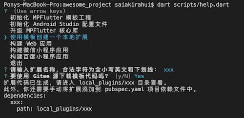

> 在开始编写扩展前，请先创建好 mpflutter 工程。

## 使用模板创建扩展

1. 使用命令行，定位到工程目录下，执行以下命令：

```sh
dart scripts/help.dart
```

2. 选择『使用模板创建一个扩展』，并完成后续操作。



3. 如上图所示，添加依赖到 `pubspec.yaml`，然后执行 `./mpdart pub get`。

## 修改平台代码

使用 VSCode 打开 `local_plugins/xxx/lib/weapp/main.ts` （我们的扩展名是 xxx，这里应替换为你创建的扩展。）

修改代码，假定我们的 MethodChannel 名字是 xxx，它可以响应 method = yyy 的方法，并在小程序上弹出一个提示框。

```typescript
/// <reference path="../typing/mpflutter.d.ts" />

export class XXXMethodChannel extends MPMethodChannel {
  async onMethodCall(method: string, params: any): Promise<any> {
    if (method === "yyy") {
      wx.showModal({content: "hello yyy"});
    } else {
      throw new Error("Method not implemented.");
    }
  }
}

pluginRegisterer.registerChannel(
  "xxx",
  XXXMethodChannel
);

```

## 修改客户端 (Dart) 代码

我们还需要修改客户端代码，以便在 Dart 中调用。

使用 VSCode 打开 `local_plugins/xxx/lib/xxx.dart`，修改为以下代码。

```dart
import 'package:flutter/services.dart';

class XXXPlugin {
  static MethodChannel methodChannel = MethodChannel(
    'xxx',
  );

  static Future yyy() async {
    await methodChannel.invokeMethod('yyy');
  }
}
```

## 发起调用

在需要调用的地方，使用 ```XXXPlugin.yyy()```，即可调起小程序的 `alert`。

## 获得返回值

当 Dart 端需要得到 Web 端的返回值时，只需要在稍微修改一下代码即可。


```typescript
/// <reference path="../typing/mpflutter.d.ts" />

export class XXXMethodChannel extends MPMethodChannel {
  async onMethodCall(method: string, params: any): Promise<any> {
    if (method === "yyy") {
      return "yyy";
    } else {
      throw new Error("Method not implemented.");
    }
  }
}

pluginRegisterer.registerChannel(
  "xxx",
  XXXMethodChannel
);

```

```dart
import 'package:flutter/services.dart';

class XXXPlugin {
  static MethodChannel methodChannel = MethodChannel(
    'xxx',
  );

  static Future<String> yyy() async {
    return await methodChannel.invokeMethod('yyy');
  }
}
```

## EventChannel

对于 EventChannel 参照模板代码即可完成编写。

## MPPlatformView

对于 MPPlatformView，我们使用的是微信小程序自定义组件。

组件位于 `local_plugins/xxx/lib/weapp/components` 目录下，参照模板代码即可完成开发。

要特别留意的是，每一个组件的配置文件 `local_plugins/xxx/lib/weapp/components/foo.json` 。

```json
{
  "component": true,
  "usingComponents": {},
  "props": ["text"],
  "propsVal": [""],
  "events": ["mockclick"]
}
```

`props` `propsVal` `events` 都是必填项，它们分别代表，需要传递到自定义组件的属性列表、属性默认值、需要回调的事件名称。